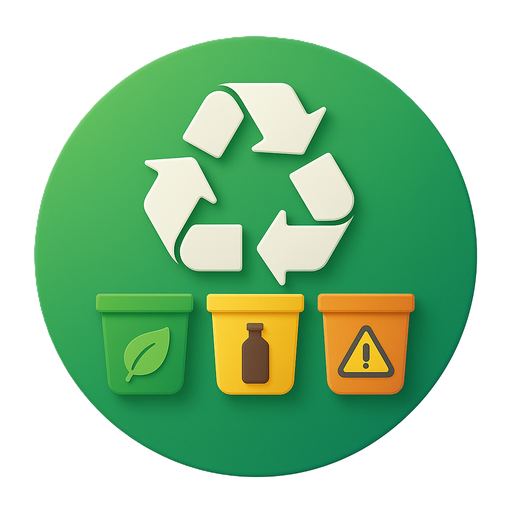

  #SIPILAH

 SIPILAH (Sistem Pintar Klasifikasi Sampah) adalah aplikasi berbasis kecerdasan buatan yang dapat mengenali jenis sampah seperti organik, anorganik, dan B3 melalui kamera smartphone. Aplikasi ini bertujuan untuk membantu masyarakat dalam memilah sampah secara cepat dan tepat demi mendukung lingkungan yang bersih dan sehat. Aplikasi SIPILAH menggunakan model deep learning MobileNet V2 untuk mendeteksi jenis sampah. Gambar sampah diambil dan diproses untuk mengetahui jenis sampah tanpa koneksi internet.

## 📖Cara Menggunakan Aplikasi
1. Buka aplikasi SIPILAH
2. Pilih menu Deteksi Jenis Sampah
3. Ambil gambar daun atau pilih dari galeri
4. Tunggu proses deteksi selesai
5. Lihat hasil deteksi dan saran tindakan

## 🚀Keunggulan Aplikasi
1. Tidak membutuhkan internet
2. Cepat dan ringan
3. Tampilan modern
4. Cocok untuk petani dan pelajar

## ⚠️Catatan Tambahan
Pastikan gambar yang digunakan terang, fokus, dan tidak buram. Gambar yang baik akan meningkatkan akurasi deteksi penyakit daun
